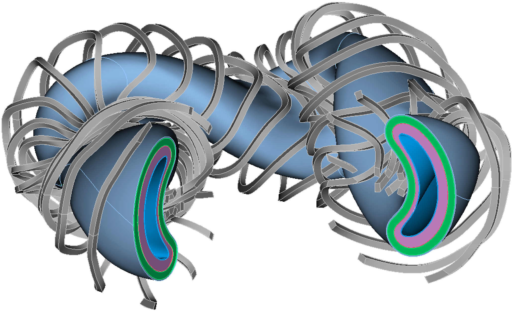

# ParaStell
Parametric 3-D CAD modeling toolset for stellarator fusion devices. This open-source Python package uses plasma equilibrium VMEC data and CadQuery to model in-vessel components of varying thickness in low-fidelity from a user-specified radial build. Furthermore, coil filament point-locus data and Coreform Cubit are used to model magnet coils of user-specified cross-section. Additional neutronics support includes the use of VMEC data and MOAB to generate tetrahedral neutron source definitions and Coreform Cubit to generate DAGMC geometries for use in Monte Carlo radiation transport software.



## Dependencies
ParaStell depends on:

- [PyYAML](https://pyyaml.org/wiki/PyYAMLDocumentation)
- [NumPy](https://numpy.org/install/)
- [SciPy](https://scipy.org/install/)
- [scikit-learn](https://scikit-learn.org/stable/install.html)
- [Coreform Cubit](https://coreform.com/products/downloads/), version 2023.11
- [CadQuery](https://cadquery.readthedocs.io/en/latest/installation.html)
- [MOAB](https://bitbucket.org/fathomteam/moab/src/master/)
- [PyStell](https://github.com/aaroncbader/pystell_uw)
- [CAD-to-DAGMC](https://github.com/fusion-energy/cad_to_dagmc)
- [OpenMC](https://github.com/openmc-dev/openmc)

## Install ParaStell
Download and extract the ParaStell repository:

```bash
git clone git@github.com:svalinn/parastell.git
```

or download the ZIP file from the repository home page. Once extracted, add the repository directory to your `PYTHONPATH`.

### Install Python Dependencies

This guide will use the conda package manager to install Python dependencies. Conda provides straight-forward installation of Python packages and switching between different collections of Python packages through the use of [environments](https://conda.io/projects/conda/en/latest/user-guide/concepts/environments.html).

If you have not already installed conda, you can use one of the following installers to do so:
- [Miniforge](https://github.com/conda-forge/miniforge)
- [Miniconda](https://docs.conda.io/en/latest/miniconda.html)
- [Anaconda](https://www.anaconda.com/)

A working conda environment with all ParaStell Python dependencies can be found in this repository's `environment.yml` file. To create the corresponding `parastell_env` conda environment on your machine, create the environment from the `environment.yml` file and activate the new environment:

```bash
conda env create -f environment.yml
conda activate parastell_env
```

Alternatively, view `INSTALL.md` for instructions on manually installing these Python dependencies using mamba.

### Install Coreform Cubit
Download and install version 2023.11 from [Coreform's Website](https://coreform.com/products/downloads/), then add the `/Coreform-Cubit-2023.11/bin/` directory to your `PYTHONPATH` by adding a line similar to the following to your `.bashrc` file:

```bash
export PYTHONPATH=$PYTHONPATH:$HOME/Coreform-Cubit-2023.11/bin/
```

Replace `$HOME` with the path to the Coreform Cubit directory on your system. Additional information about adding modules to your `PYTHONPATH` can be found [here](https://www.tutorialspoint.com/How-to-set-python-environment-variable-PYTHONPATH-on-Linux).
While it is possible to use ParaStell with older versions of Cubit, additional steps not in this guide may be required.

If you do not have a Coreform Cubit license, you may be able to get one through [Cubit Learn](https://coreform.com/products/coreform-cubit/free-meshing-software/) at no cost.

## Executing ParaStell Scripts with YAML Input
While ParaStell can imported as a module to make use of its Python API, ParaStell also has an executable to alternatively call functionality via command line. This executable uses a YAML configuration file as a command-line argument to define input parameters.

To make use of this feature, add the ParaStell `executables` directory to your `PATH` by adding a line similar to the following to your `.bashrc` file:

```bash
export PATH = $PATH:$HOME/parastell/executables/
```

Replace `$HOME` with the path to the ParaStell repository directory on your system. Information about adding directories to your `PATH` can be found [here](https://phoenixnap.com/kb/linux-add-to-path).

Next, give any files in the `executables` directory file execution permission:

```bash
chmod -R u+x $HOME/parastell/executables/
```

Now, the executable can be run from command line with a corresponding YAML file argument. For example:

```bash
parastell config.yaml
```

See the executable's help message for more details.
